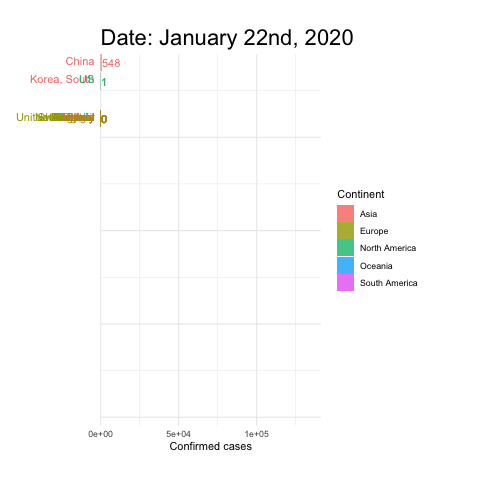
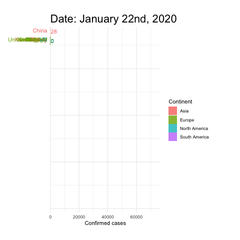

```{r setup, include=FALSE}
knitr::opts_chunk$set(echo = FALSE)
```

```{r, warning = F, message = F}
library(ggplot2)
library(plotly)
library(tidyverse)
library(utils)
library(lubridate)
library(htmlwidgets)
library(crosstalk)
library(shiny)
curr.dir = paste0(here::here(), "/EDA/")
# print(curr.dir)
# knitr::opts_knit$set(root.dir = curr.dir)
LastRunTime = readRDS("ProcessedData/LastRunTime.rds")
```

# Introduction

**Last updated:** `r LastRunTime` UK TIME

Hello and thanks for visiting my page on COVID19 exploratory data analysis. I have made this site as a learning exercise but also to better understand the current state of the pandemic at multiple levels.

There are many more plots and perspective I would like to exploit and that I am currently working on:

* Bubble map over time and by exact location
* Graph of the reproduction number (R0) over time
* Graphs of the global statistics
* Log10 switch for the amounts of people tested positive, dead or recovered
* Give context and explanations to the graphics

If you have any other suggestions please get in touch at [luis.chaves15@imperial.ac.uk](mailto:luis.chaves15@imperial.ac.uk).

Data sources:

* [Corona Virus dataset @ Kaggle](https://www.kaggle.com/sudalairajkumar/novel-corona-virus-2019-dataset)

Some amazing resources:

* [John Hopkins University dashboard](https://coronavirus.jhu.edu/map.html)
* [SARS-COV2 phylogenetic tree](https://nextstrain.org/ncov)
* [COVID19 scenario explorer](https://neherlab.org/covid19/)

_Disclaimer:_ This is the first website project I get involved in so things may not work as smoothly as I would want them too! If you encounter the site being too laggy, do let me know! I am working to make it be smoother and take less time to load.

_**Disclaimer 2:**_ The whole website is interactive! Have fun playing with the graphs!

# Up-to-date numbers by continent and by country

## Table view
```{r}
selectInput("table", label = "By",
              choices = c("Continent", "Country","Full"), selected = "Country")
```

```{r warning = F, message = F}
sum.table = readRDS("ProcessedData/sumtable.rds")
continent.wise =  readRDS("ProcessedData/continentWise.rds")
```

```{r}
renderTable(
  switch(input$table,
         "Country"=sum.table %>% head(20),
         "Continent"=continent.wise,
         "Full"=sum.table),
  digits = 0
)
```

## Up-to-date number of events by location

```{r}
# add filter to line below if you'd like to filter by anything
# e.g. df.plotly  %>% filter(Active > 1000)
toPlot = readRDS("ProcessedData/df_plotly.rds")
## Number of deaths
deads <- plot_ly(
  type="treemap",
  values=toPlot$Deaths,
  labels = toPlot$labels,
  parents= toPlot$parent,
  hoverinfo="label+value+percent parent+percent root"
  # textinfo="label+value+percent parent+percent entry+percent root",
  #domain=list(column=0)
)

## Number of confirmed
conf <- plot_ly(
  type="treemap",
  values=toPlot$Confirmed,
  labels = toPlot$labels,
  parents= toPlot$parent,
  hoverinfo="label+value+percent parent+percent root"
  # textinfo="label+value+percent parent+percent root"
  #domain=list(column=0)
)

## Number of recovered
rec <- plot_ly(
  type="treemap",
  values=toPlot$Recovered,
  labels = toPlot$labels,
  parents= toPlot$parent,
  hoverinfo="label+value+percent parent+percent root"
  #domain=list(column=0)
)

## Case-Fatality Rate by Country
deaths.conf <- plot_ly(
  type="treemap",
  values=round(toPlot$Deaths/toPlot$Confirmed,4)*100,
  labels = toPlot$labels,
  parents= toPlot$parent,
  hoverinfo="label+value+percent",
  hovertext = "Potato"
  #domain=list(column=0)
)

## Ratio of recovered-to-confirmed cases
rec.conf <- plot_ly(
  type="treemap",
  values=toPlot$Recovered/toPlot$Confirmed,
  labels = toPlot$labels,
  parents= toPlot$parent
  # textinfo="label+value+percent parent+percent entry+percent root",
  #domain=list(column=0)
)
```


```{r}
selectInput("t.choice", label = "Event/Metric",
              choices = c("Deaths(D)", "Recovered(R)","Confirmed(C)",
                          "D/C ratio", "R/C ratio"), selected = "Deaths(D)")
```

```{r}
ItalyDC = round(with(sum.table[sum.table$Country.Region == "Italy",], Deaths/Confirmed),4)*100
GermanyDC = round(with(sum.table[sum.table$Country.Region == "Germany",], Deaths/Confirmed),4)*100
```

```{r}
renderText(
  if (input$t.choice=="D/C ratio"){
    paste0("In this graph we can clearly see how the virus (and potentially different strains of the virus) are affecting every country. As of today, Italy has a case-fatality rate (CFR) of ", as.character(ItalyDC), "% where as Germany has a CFR of ", as.character(GermanyDC), "% suggesting the strain in Germany is way less deadly than the italian strain.")
  }
)
```


```{r}
renderPlotly(
  if (input$t.choice == "Deaths(D)"){
  deads
} else if (input$t.choice == "Confirmed(C)") {
  conf
} else if (input$t.choice == "Recovered(R)") {
  rec
} else if (input$t.choice == "D/C ratio") {
  deaths.conf
} else if (input$t.choice == "R/C ratio") {
  rec.conf
}
)
```

# COVID19 over time - Timelines

```{r}
all.time = readRDS("ProcessedData/cleanTime.rds")
```

```{r}

## deathsOverTime
plt.deaths.time = ggplotly(all.time %>% filter(Metric == "Deaths") %>% 
                             ggplot(aes(x = Date, y = Amount,
                                        color = Continent, group = Country))+
                             geom_line()+theme_minimal()+scale_color_brewer(palette = "Paired")+
                             ylab("Cumulative number of deaths")+ggtitle("Cumulative number of deaths over time")
)


## confirmed over Time}
plt.conf.time = ggplotly(all.time %>% filter(Metric == "Confirmed") %>% 
                           ggplot(aes(x = Date, y = Amount,
                                      color = Continent, group = Country))+
                           geom_line()+theme_minimal()+scale_color_brewer(palette = "Paired")+
                           ylab("Cumulative number of confirmed cases")+
                           ggtitle("Cumulative number of confirmed cases over time")
)


## Recovered over time
plt.rec.time = ggplotly(all.time %>% filter(Metric == "Recovered") %>% 
                          ggplot(aes(x = Date, y = Amount,
                                     color = Continent, group = Country))+
                          geom_line()+theme_minimal()+scale_color_brewer(palette = "Paired")+
                          ylab("Cumulative number of Recovered cases")+ggtitle("Cumulative number of recovered cases over time")
)


## Cumulative number of active cases
plt.act.time = ggplotly(all.time %>% pivot_wider(names_from = Metric, values_from = Amount) %>% 
                          mutate(Active = Confirmed-Recovered-Deaths) %>%  
                          ggplot(aes(x = Date, y = Active,
                                     color = Continent, group = Country))+
                          geom_line()+theme_minimal()+scale_color_brewer(palette = "Paired")+
                          ylab("Number of active cases")+ggtitle("Number of active cases over time")
)

```

## Cumulative number of events over time

```{r}
selectInput("plt.time.choice", label = "Event/Metric",
              choices = c("Deaths(D)", "Recovered(R)",
                          "Confirmed(C)", "Active(A)"), selected = 20)
```

```{r}
renderPlotly(
  if (input$plt.time.choice == "Deaths(D)"){
  plt.deaths.time
} else if (input$plt.time.choice == "Confirmed(C)") {
  plt.conf.time
} else if (input$plt.time.choice == "Recovered(R)") {
  plt.rec.time
}  else if (input$plt.time.choice == "Active(A)") {
  plt.act.time
}
  )
```

## Number of events per day over time
```{r}
all.per.day = readRDS("ProcessedData/allPerDay.rds")
```

```{r}

##deathsPerDayOverTime}
d.daytime = ggplotly(all.per.day %>% filter(Metric == "Deaths") %>% 
                       ggplot(aes(x = Date, y = Amount,
                                  color = Continent, group = Country))+
                       geom_line()+theme_minimal()+scale_color_brewer(palette = "Paired")+
                       ylab("Number of deaths per day over time")+ggtitle("Number of deaths per day over time")
)

##casesPerDayOverTime}
conf.daytime = ggplotly(all.per.day %>% filter(Metric == "Confirmed") %>% 
                          ggplot(aes(x = Date, y = Amount,
                                     color = Continent, group = Country))+
                          geom_line()+theme_minimal()+scale_color_brewer(palette = "Paired")+
                          ylab("Cumulative number of confirmed cases")+
                          ggtitle("Cumulative number of confirmed cases over time")
)


##recoveredPerDayOverTime}
rec.daytime = ggplotly(all.per.day %>% filter(Metric == "Recovered") %>% 
                         ggplot(aes(x = Date, y = Amount,
                                    color = Continent, group = Country))+
                         geom_line()+theme_minimal()+scale_color_brewer(palette = "Paired")+
                         ylab("Cumulative number of Recovered cases")+ggtitle("Cumulative number of recovered cases over time")
)


```


The value for any day is the difference of the cumulative cases/deaths/recoveries for that day day and the day before then.

```{r}
selectInput("plt.day.choice", label = "Event/Metric",
              choices = c("Deaths(D)", "Recovered(R)",
                          "Confirmed(C)"), selected = 20)
```


```{r}
renderPlotly(
  if (input$plt.day.choice == "Deaths(D)"){
  d.daytime
} else if (input$plt.day.choice == "Confirmed(C)") {
  conf.daytime
} else if (input$plt.day.choice == "Recovered(R)") {
  rec.daytime
}
  )
```

## Barplots over time

Over time from `r format(min(all.time$Date),"%B %dnd")` to  `r format(max(all.time$Date),"%B %dnd")`

```{r}
## ideally in this bit I'd like to have the y axis being dynamics and changing 
# with the values
all.time = all.time %>% distinct()

all.timeLONG = all.time %>%
  pivot_wider(names_from = Metric, values_from = Amount) %>%
  filter(Date == max(Date)) %>% arrange(-Confirmed)

bar.over.time.gg =   all.time %>% 
  filter(Country %in% all.timeLONG$Country[1:20]) %>%
  mutate(Date=as.numeric(Date-min(Date))) %>%
  arrange(Metric) %>% #lucky confirms comes first
  ggplot(aes(x = Country,
             y = Amount,frame = Date))+
  geom_col(aes(fill = Metric),
           position = "identity", show.legend = F)+
  coord_flip()+theme_minimal()+xlab("Country")

bar.over.time = ggplotly(bar.over.time.gg) %>%
  animation_opts(redraw=F) %>%
  animation_slider(
    currentvalue = list(
      prefix = paste0("Days from ",
                      min(all.time$Date),": ")))

# not going this way because of the tripled legend

# bar.over.time.facet = ggplotly(
#   all.time %>% 
#     filter(Country %in% all.timeLONG$Country[1:20]) %>%
#     mutate(Date=as.numeric(Date-min(Date))) %>%
#     arrange(Metric) %>% #lucky onfirms comes first
#   ggplot(aes(x = Country,
#              y = Amount,frame = Date,
#              fill = Continent))+
#   geom_col(position = "identity")+
#   coord_flip()+theme_minimal()+theme(axis.text.x = element_text(angle = 45))+
#     xlab("Country")+facet_wrap(~Metric, scales = "free_x")
# ) %>% animation_opts(redraw=F) %>%
#   animation_slider(
#     currentvalue = list(
#       prefix = paste0("Days from ",
#                       min(all.time$Date),": ")))

forSubplot = all.time %>% 
  filter(Country %in% all.timeLONG$Country[1:20]) %>%
  mutate(Date=as.numeric(Date-min(Date)))

facet1 =  forSubplot %>% filter(Metric=="Confirmed") %>% 
  plot_ly(y = ~Country, x = ~Amount, frame = ~Date,color = ~Continent,
          type = "bar",showlegend = T) %>%
  layout(yaxis = list(title = "Top 20 countries by confirmed cases"),
         xaxis = list(title = "Confirmed cases"))

facet2 =  forSubplot %>% filter(Metric=="Recovered") %>% 
  plot_ly(y = ~Country, x = ~Amount, frame = ~Date,color = ~Continent,
          type = "bar",showlegend = F) %>%
  layout(yaxis = list(title = "", showticklabels = F),
         xaxis = list(title = "Recoveries",
                      range = c(0,max(forSubplot$Amount[forSubplot$Metric == "Recovered"]))
         )) 

facet3 =  forSubplot %>% filter(Metric=="Deaths") %>% 
  plot_ly(y = ~Country, x = ~Amount, frame = ~Date,color = ~Continent,
          type = "bar",showlegend = F) %>%
  layout(yaxis = list(title = "", showticklabels = F),
         xaxis = list(title = "Deaths", range = c(0,max(forSubplot$Amount[forSubplot$Metric == "Deaths"]))))

byevent = suppressWarnings(
  subplot(facet1, facet3, facet2, 
          titleX = T, nrows = 1,
          titleY = T) %>%  animation_slider(
            currentvalue = list(
              prefix = paste0("Days from ",
                              min(all.time$Date),": ")))
)

```

```{r message = F}
selectInput("barplot", label = "Type of barplot",
            choices = c("Stacked bars", "By event"), selected = "Stacked bars")

renderPlotly(
  switch(input$barplot,
         "Stacked bars" = bar.over.time,
         "By event" = byevent)
)
```

## Race plots

### Confirmed cases


### Deaths


### Recovered



# COVID19 over space - Maps


```{r}
# could have 2 maps, one by iso code the other by actual location (long,lat)
country.iso = read.csv("https://gist.githubusercontent.com/tadast/8827699/raw/7255fdfbf292c592b75cf5f7a19c16ea59735f74/countries_codes_and_coordinates.csv")
country.iso$Alpha.3.code = trimws(country.iso$Alpha.3.code)
all.time = all.time %>% 
  mutate(Country = ifelse(Country=="Iran", "Iran, Islamic Republic of",
                          ifelse(Country =="Korea, South","South Korea",
                                 ifelse(Country=="Laos","Lao People's Democratic Republic",
                                        ifelse(Country=="Moldova", "Moldova, Republic of",
                                               ifelse(Country == "Syria","Syrian Arab Republic",
                                                      ifelse(Country=="Tanzania","Tanzania, United Republic of",
                                                             ifelse(Country=="US","United States", Country)
                                                             )
                                                      )
                                        )
                                 )
                          )
  )
  )

all.time.geo = merge(all.time, country.iso[,c("Country","Alpha.3.code")], by = "Country", all.x = T)

all.time.geo = all.time.geo %>% select(-Continent) %>%
  pivot_wider(names_from = "Metric", values_from = "Amount") %>%
  mutate(Date=as.numeric(Date-min(Date)))
```


```{r}
StartDate = min(all.time$Date)

l <- list(color = toRGB("grey"), width = 0.5)

g <- list(
  showframe = T,
  showcoastlines = FALSE,
  projection = list(type = 'natural earth')
)

all.time.geo %>%
  plot_geo() %>% add_trace(z = ~Confirmed, color = ~Confirmed, frame = ~Date, colors = 'Blues',
              text = ~Country, locations = ~Alpha.3.code, marker = list(line = l)) %>% 
  colorbar(title = 'Confirmed') %>%
  layout(
    title = 'Number of confirmed cases over time',
    geo = g
  ) %>% animation_opts(redraw = F) %>%
  animation_slider(
    currentvalue = list(
      prefix = paste0("Days from ",
                      format(StartDate, "%B %dnd"),": ")))
```


