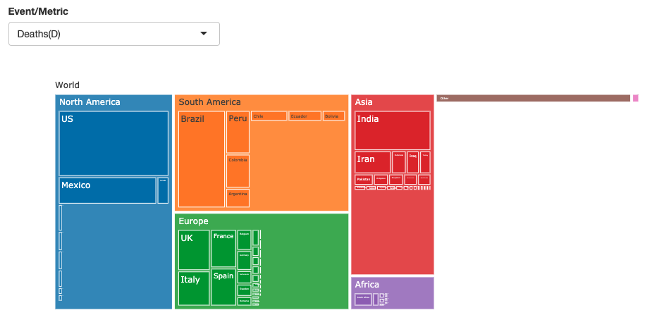
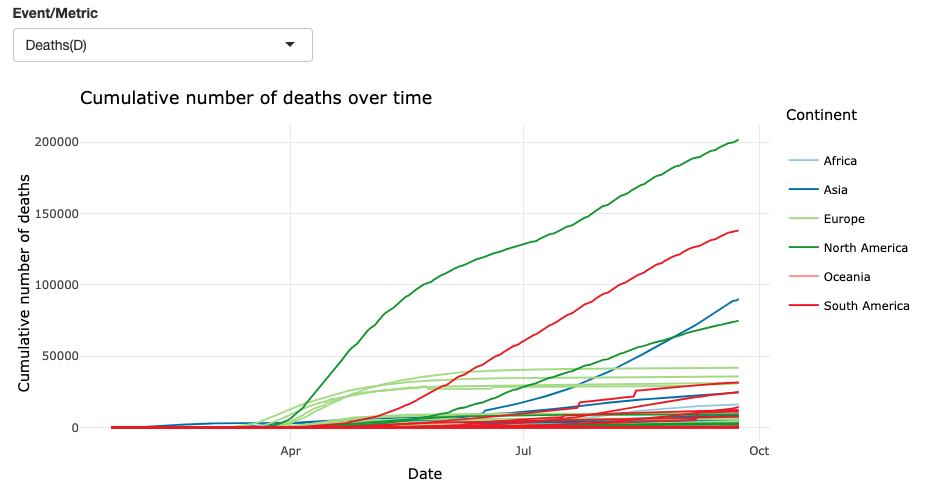
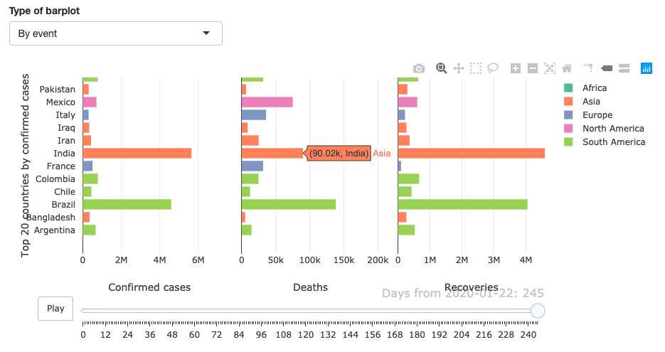
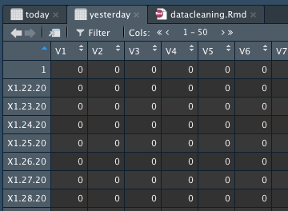

```{r setup, include=FALSE}
knitr::opts_chunk$set(echo = TRUE, message = F, warning = F, fig.align = 'center')
```

# Disclaimer

After working on this notebook for a long time, I sadly realised the data source have unexplained artefacts (see [final section](#wtf)). Due to this, I decided to make another notebook with a new data source (which is where you may come from). _If you are learning data science or R, you may still find this notebook helpful. It illustrates very well the painful (but extremely important) process of data cleaning that all data scientist should know intimately._

# Libraries

We will use 3 libraries for data cleaning & wrangling: `lubridate`(for dates), `dplyr` and `tidyr`(for wrangling).

```{r echo = FALSE, include = TRUE}
library(dplyr)
library(lubridate)
library(tidyr)
```

# Raw data

Our data comes from [Kaggle's Novel-Coronavirus dataset](https://www.kaggle.com/sudalairajkumar/novel-corona-virus-2019-dataset). This dataset includes several files you can see below.
```{sh echo = TRUE, include = T}
tree ../RawData
```

Out of this files I only ended up using 4 files: `covid_19_data.csv`, `time_series_covid_19_{confirmed, deaths, recovered}.csv`. Let's quickly load these files and inspect what they contain:

```{r}
covid_data = read.csv("../RawData/covid_19_data.csv")
deaths_time = read.csv("../RawData/time_series_covid_19_deaths.csv")
confirmed_time = read.csv("../RawData/time_series_covid_19_confirmed.csv")
recovered_time = read.csv("../RawData/time_series_covid_19_recovered.csv")
```

As we see below `covid_19_data.csv` contains `r nrow(covid_data)` rows and `r ncol(covid_data)` columns. Each row includes the number of confirmed, recovered and deaths recorded in a corresponding province (and respective country) at a given date. 

```{r}
head(covid_data, 10)
```

```{r}
tail(covid_data, 10)
```

The time series files are a bit different. The deaths and confirmed tables contain `r nrow(deaths_time)` whereas the recovered table contains `r nrow(recovered_time)`. These tables contain 4 columns that never change (the first 4 - province, country, latitude and longitude). Each of the remaining columns corresponds to the number of deaths, confirmed or recovered cases for every recorded day (one column == one day). This to me is weird.

```{r}
head(confirmed_time[,1:10])
```
The `covid_data` table does not contain the continent each country belongs to. We will be using a utility table which contains a list of all countries in the World and their corresponding continents.

## Note

__In this notebook I am sort of cheating. Data cleaning and wrangling is about putting your data in a format that serves as input for a model or plotting function. When I made this project I first investigated which plots I wanted to make and which input formats were necessary for such plots.__ In the interest of coherence, I'll flash-forward and tell you we'll be making the following plots:

* [Treemap charts](https://plotly.com/r/treemaps/) 


* [Line charts](https://plotly.com/r/line-charts/): we will be using line charts to display the cumulative number of cases per region and the daily number of cases.


* Animated [bar charts](https://plotly.com/r/bar-charts/)


* [Map charts/Chloropeth](): actually used leaflet here, plotly map charts are a bit under developed.

We will be making 3 tables for all these charts: the `covid_data` table, the `time_series` table and the `clean_time_series` table.

### Up to date table

We will be adding several extra columns to the table (on top of [the ones described earlier](#raw-data)). First we will make a column with the number of `Active` cases (= `Confirmed`-`Deaths`-`Recovered`)

```{r}
## Calculate active cases
covid_data$Active = covid_data$Confirmed - covid_data$Deaths-covid_data$Recovered

## Change format of date from character to Date
covid_data$ObservationDate = mdy(covid_data$ObservationDate)

## Read utils table
countryToContinent = read.csv("../UtilsData/Countries-Continents.csv")

## Add countries that were missing or not properly formatted
extra_columns = cbind(Continent = c(rep("Asia",5),
                                    rep("Europe",2),
                                    "Africa"),
                      Country = c("Hong Kong", "Mainland China", "Macau", "Taiwan","South Korea",
                                  "UK", "Czech Republic",
                                  "Burkina Faso"))
countryToContinent = rbind(countryToContinent, extra_columns)

## Add continent column to covid_data
covid_data = merge(covid_data, countryToContinent,
                   by.x = "Country.Region",
                   by.y = "Country",
                   all.x = TRUE,
                   sort = FALSE)
```

Some regions do not come with a corresponding country (e.g. Gaza Strip, Russia). To simplify things we will simply label these as having `Other/Missing` continent. After this we will save the dataset as an `.RDS` file. Find below the list of those country/regions with missing continent information:

```{r}
## List of country/regions with missing continent info
unique(covid_data %>% filter(is.na(Continent)) %>% select(Country.Region))
```

```{r}
## replace NA continent by Other/Missing label
covid_data$Continent = ifelse(is.na(covid_data$Continent),
                              "Other/Missing",
                              covid_data$Continent)
```

We will call the stored file `uptodate.rds` (I know, name could be better)
```{r echo = T, include = T, eval = F}
saveRDS(covid_data, '../ProcessedData/uptodate.rds')
```

### Time-series data - by Country

The data in the `time_series` tables sometimes is split across regions within a country (such as states in the US, or regions in Australia). Because we are making a global dashboard, we are going to extract the values by country only. To to do this, we've written a short function called `TimeByCountry()`:

```{r}
TimeByCountry = function(data) {
  
  ## sum values by country
  over.country = data %>% 
    select(-c(Lat, Long, Province.State)) %>%
    group_by(Country.Region) %>% summarise_all(sum) %>% ungroup()
  
  return(over.country)
}
```

In addition to this we, will also merge this data with the country2continent table.
```{r}
## At this point data is by country (no continent data) and contains latitude and longitude info
deaths_time = TimeByCountry(deaths_time)
confirmed_time = TimeByCountry(confirmed_time)
recovered_time = TimeByCountry(recovered_time)

## Merge with continent data
deaths_time = merge(countryToContinent,deaths_time,  by.y = "Country.Region", by.x = "Country")
confirmed_time = merge(countryToContinent, confirmed_time, by.y = "Country.Region", by.x = "Country")
recovered_time = merge( countryToContinent,recovered_time, by.y = "Country.Region", by.x = "Country")

```

At this point each row corresponds to a country's information, if we remove the `Country` and `Continent` columns (the 1st two) we can hence plot any row to see how COVID has progressed in such country (This is not yet a [tidy dataframe](https://vita.had.co.nz/papers/tidy-data.pdf))

```{r}
## index 55 is France
plot(t(deaths_time[55,-c(1,2)]),
     ylab = paste('COVID Deaths in:',deaths_time[55,1]),
     xlab = 'Days from January 22nd')
```

```{r}
## index 24 is Brazil
plot(t(confirmed_time[24,-c(1,2)]),
     ylab = paste('COVID Deaths in:',deaths_time[24,1]),
     xlab = 'Days from January 22nd')
```


#### Events per day

Now we will calculate the number of events (i.e. new cases, recoveries, deaths) per day. All data available is cumulative hence we will simply calculate the number of cases for any specific day as the number of cases recorded that given day minus the number of cases from the day before. We will use the function `lag()`(see `help(lag)`) to simply shift the number of events from "today". Again we will make a handy function for this:

```{r}
perDay = function(cumulative_table){
  today = cumulative_table %>% select(-c(Country, Continent))
  
  ## tranpose table so that each column corresponds to a country
  ## and each row corresponds to a day
  today = t(today)
  
  ## shift the whole table down by a row (one day) with lag function
  yesterday = lag(today)
  
  ## we will fill the first row, which was filled with NAs, with 0s
  yesterday[1,] = 0
  
  per_day = today - yesterday
  
  ## transpose again
  per_day = t(per_day)
  
  ## combine back with original table
  output = cumulative_table %>% select(Country, Continent)
  output = cbind(output, per_day)
  return(output)
}
```

To help you understand this function this is what `today` and `yesterday` would look like (each column would correspond to a country):

Today table                |  Yesterday table
:-------------------------:|:-------------------------:
  |  

Now, we use the above function to calculate the number of deaths, confirmed cases and recoveries per day, per country.
```{r}
deaths_per_day = perDay(deaths_time)
confirmed_per_day = perDay(confirmed_time)
recovered_per_day = perDay(recovered_time)
```

Next, we are going to re-structure our data frame so that each rows corresponds to the number of events in any single day for any given country. This is called tidy data and will make it much easier for us to work with `ggplot2` functions. The main function we are using to do this is the `pivot_longer()` function.

```{r}
deaths_per_day = deaths_per_day %>%
  pivot_longer(-c(Country,Continent),
               names_to = "Date",
               values_to = "Amount") %>%
  mutate(Metric = "Deaths")

confirmed_per_day = confirmed_per_day %>%
  pivot_longer(-c(Country,Continent),
               names_to = "Date",
               values_to = "Amount") %>%
  mutate(Metric = "Confirmed")

recovered_per_day = recovered_per_day %>% 
  pivot_longer(-c(Country,Continent),
               names_to = "Date",
               values_to = "Amount") %>% 
  mutate(Metric = "Recovered")

## combine all in one dataset
all_per_day = rbind(deaths_per_day, confirmed_per_day, recovered_per_day)
```

As you can see below the date format is not very pretty (nor standard):
```{r}
all_per_day$Date[1:10]
```
We will change this by using `as.Date()` which allow us to pass the input format with the argument `format`:
```{r}
all_per_day$Date = as.Date(sapply(strsplit(all_per_day$Date, "X"), "[[",2), format = "%m.%d.%y")
```

__Note:__ This bit (`sapply(strsplit(all_per_day$Date, "X"), "[[",2)`) strips each date strings after the 'X' characters and then picks the 2nd element of each string (i.e. MM.DD.YY)

As I said before, this modification allows us now to easily work with `ggplot` and `dplyr`:
```{r, fig.align = 'center'}
library(ggplot2)
library(plotly)
ggplotly(
all_per_day %>% 
  filter(Country == 'Spain') %>% 
  ggplot(aes(x = Date, y = Amount, color = Metric))+
  geom_line()
)
```

# WTF

After reviewing this beautiful notebook I have noticed these data artefacts (like in the plot above) where suddenly the daily number of cases or even deaths becomes NEGATIVE! COVID-19 is giving birth! I went straight to the [John Hopkins University source on GitHub](https://github.com/CSSEGISandData/COVID-19) and many people have noticed the same problem:

* [Negative cases distroting charts](https://github.com/CSSEGISandData/COVID-19/issues/3157)
* [Almost 2000 people in Spain resurrected? #2572](https://github.com/CSSEGISandData/COVID-19/issues/2572)
* [Decrease in Confirmed Cases for Two Counties in Vermont #2486](https://github.com/CSSEGISandData/COVID-19/issues/2486)
* [Daily reports: Japan confirmed cases has dropped #2431](https://github.com/CSSEGISandData/COVID-19/issues/2431)
* [Nevada US confirmed cases has dropped! #2416](https://github.com/CSSEGISandData/COVID-19/issues/2416)

At this point, I had two choices: either bang my head against the wall and google explanations for these artefacts (e.g. update on validity of stats? testing?), which I've already done) or look for other sources. I could also over-engineer a solution to this problem and do smart (actually super dumb) data cleaning, further distorting the data and making arbitrary decisions. From my view, these issues are pretty serious and should be addressed by the sources. __At this point I cannot take the [Novel Corona-Virus dataset](https://www.kaggle.com/sudalairajkumar/novel-corona-virus-2019-dataset) or the [JHU repo](https://github.com/CSSEGISandData/COVID-19) data as rigorous enough and instead I've decided to switch my data source to [Our World in Data](https://ourworldindata.org/coronavirus), which does not seem to have these problems.__
